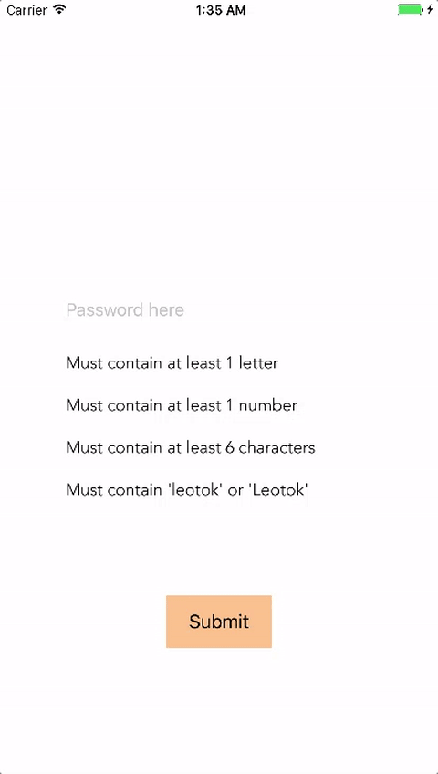

# PasswordStrengthView
Strength bar and rules' hints view for iOS

## Example



## How to

On your viewcontroller add:
```swift

passwordTextField = UITextField()
passwordTextField.delegate = self
passwordTextField.frame.size = CGSize(width: view.frame.width * 0.7, height: 40)
passwordTextField.center = CGPoint(x: view.frame.width * 0.5, y: view.frame.height * 0.4)
passwordTextField.placeholder = "Password here"
view.addSubview(passwordTextField)
        
let frame = CGRect(x: passwordTextField.frame.origin.x, y: passwordTextField.frame.origin.y + passwordTextField.frame.size.height, width: passwordTextField.frame.size.width, height: 100)
passwordStrength = PasswordStrengthView(frame: frame)
view.addSubview(passwordStrength)
```
and the following textfield's delegate:

```swift
func textField(_ textField: UITextField, shouldChangeCharactersIn range: NSRange, replacementString string: String) -> Bool {
        
    let textFieldText: NSString = textField.textas NSString? ?? ""
    let txtAfterUpdate = textFieldText.replacingCharacters(in: range, with: string)
        
    mayPressButton = passwordStrength.updateStrength(password: txtAfterUpdate)
                
    return true
}
```

You can add new rules:

```swift
passwordStrength.addRule(text: "Must contain 'leotok' or 'Leotok'", regex: "([a-zA-Z])*((leotok)|(Leotok))([a-zA-Z])*")
```

And you can also enable/disable the strengthBar or the hints:
```swift
passwordStrength.enableHints = true
passwordStrength.enableBar = true
```
